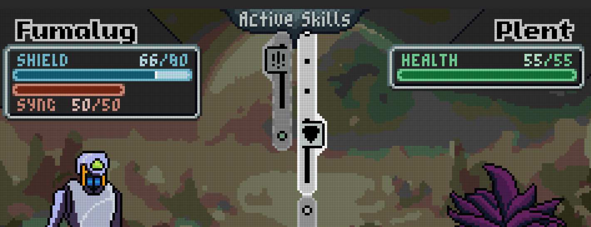
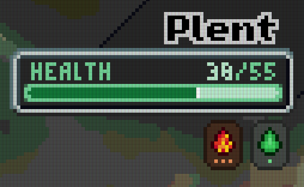

# Combat System

Combat in *Project F* is a tactical, turn-based system built on **skills, stances, and statuses**. Combat is a mix between real time and turn-based, rewarding players who can maintain real-time tempo. Encounters are designed so that the player should expect to take some damage, there is no expectation that players avoid damage entirely. Instead, a player's shield quickly regenerates outside of battle allowing for continuous play through many combat encounters.

---

## Core Flow

- Combatants execute skills to damage their opponent.
- Skills trigger abilities on a **shared tick timeline**, each opponents activating in parallel.
- Ticks alternate between the **player’s Animech** and the **opponent**.
- Each skill is composed of multiple ticks, which may:  
  - Deal damage
  - Apply a status
  - Enter a stance
  - Or do nothing

When a skill ends and no new skill is queued, combat **pauses** until the player selects their next skill. Planning ahead is rewarded however: if you pre-queue skills so that combat flows uninterrupted, you gain **Tempo**, which increases the effectiveness of certain skills and stances.

In the image below you can see an example of player and opponent skills. Skills flow up, and as the "tick dots" hit the upper threshold, they trigger. On the left hand side you see a skill which starts with a 3-tick vulnerable stance ("!!!"), and the 4th dick does damage. On the right side, a damage tick *just* triggered, following by 2 idle ticks, then a 2-tick defensive stance (shield). In the case, the damaging tick on the left will trigger while the opponent is in a defensive stance, reducing its effectiveness.

---

## Stats

- **Player (Animech)**  
  - **Shield**  
    - First line of defense.  
    - Regenerates quickly between encounters.  
    - Absorbs chip damage so that every fight feels dangerous but recoverable.  
  - **Sync**  
    - Represents the soul-link between you and the Animech.  
    - Depletes only once the shield is broken.  
    - If Sync reaches zero, the Animech is destroyed and the run ends.  

- **Opponents**  
  - Most creatures simply have **Health**.  
  - Special enemies may have layered health models, such as:  
    - Shield + Health  
    - Sync-like integrity  
    - Multiple health bars representing distinct phases or mechanics  
  - Layers can behave differently: one may regenerate, another may only take damage once a prior layer is depleted, etc.  

---

## Skills & Ticks

- Each **skill** has a fixed number of ticks.  
- Example: An 8-tick skill may:  
  - Tick 1: Deal light damage  
  - Ticks 2–3: Idle  
  - Ticks 4–6: Associated with a defensive stance  
  - Tick 7: Idle  
  - Tick 8: Deal heavy damage + apply a status  

- Because ticks alternate globally (player → enemy → player → enemy), careful timing is critical to avoid being vulnerable when the opponent attacks.

---

## Stances

Stances are **temporary combat states** tied to specific ticks of a skill.  
- If the timelines is between two ticks which share the same stance, you are considered to be in that stance until the next tick begins.
- If an opponent acts while you are in a stance, the stance changes how that interaction plays out.  

**Examples:**  
- **Block** – Reduce incoming damage.  
- **Reflect** – Reduce incoming damage and reflect part back.  
- **Vulnerable** – If hit, remaining ticks of the current skill are canceled.  

---

## Statuses

Statuses are **persistent effects** applied by skills. They exist independently of skills once active.  

- Each status has **stacks** and a **level (1–3)**.  
- Each tick, stacks are reduced according to rules specific to that status.  
- The level determines the potency of the effect.  

**Examples:**  
- **Burning (Thermal)** – One stack removed per tick. Each tick adds to a hidden *exposure counter*, increasing damage the longer you stay burning. Exposure resets instantly when burning ends.  
- **Poison (Corrosive)** – At higher stacks, fewer stacks are removed per tick, making poison linger longer. Damage scales with the current level.  

Statuses are thematically aligned with the game’s five combat **flavors**.

Below is an example of how statuses are represented - in this case: Level 3 burning and Level 1 poison.

---

## Creature Types

While not a rock-paper-scissors system, the five types define the **themes and behaviors** of skills and statuses:  Kinetic, Thermal, Corrosive, Voltaic, and Growth. See [Types](types.md) for more details.

---

## Meta Menu

In addition to using equipped skills, the player may access meta actions during combat:  

- **Fight** – Use one of the four equipped moves.  
- **Flee** – Attempt to escape combat. Success is based on effective level comparison. Failure results in a **stunned state**, where the opponent can continue to act until recovery.  
- **Xenocrypt** – Deploy the [Xenocrypt](xeno-tools.md) to capture a creature’s essence.  
  - Yields **more Research Points** for that creature type.  
  - Grants **less Experience** for the Animech.  
- **Items** – Rare, limited-use consumables such as healing or temporary buffs.  

---

## Rewards

After combat, the player may receive two forms of progression:  

- **Experience (XP)** – General growth for the Animech.  
  - Increases core stats such as Sync, Shield, regeneration rate.  
  - Unlocks traversal abilities (e.g. dashing over gaps).  
  - Improves Xenocrypt effectiveness.  

- **Research Points** – Specific to the defeated creature type.  
  - Used at HQ to unlock that creature’s moves through its skill tree.  
  - Different creatures provide 1–6 possible moves each.  

Only resources successfully **extracted** return to HQ at the end of a run.

---

## Future Extensions

During expeditions, the player may also discover **temporary resource caches** that provide roguelike modifiers to combat. These grant run-specific bonuses such as:  

- Increased poison damage  
- Reduced vulnerability chance  
- Bonus damage against burning enemies  

These elements enhance replayability and tactical variety but are documented separately in the **Exploration & Adventure** guide.  
